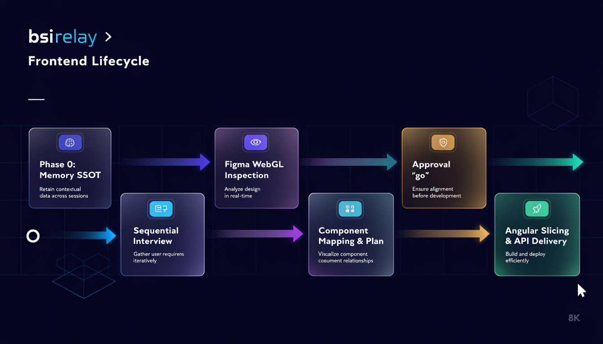
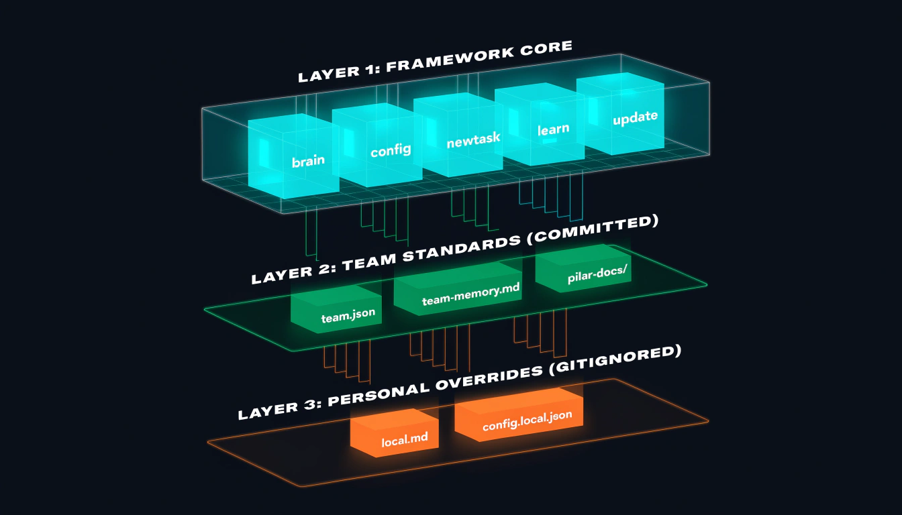

# bsirelay

**An agentic delivery, memory, and workflow framework designed for frontend engineering in BSI ecosystems.**

[](https://saweria.co/heizaaa)
[](LICENSE)
[](#cli-tooling-npx-bsirelay)
[](#python-visual--rule-analysis)
[](#installation)

---

bsirelay standardizes how AI coding agents read Figma designs, slice Angular/web interfaces, integrate backend APIs, manage team knowledge, and prevent behavioral drift via strict human-in-the-loop execution gates.

---

## Table of Contents

- [How it works](#how-it-works)
- [The Basic Workflow](#the-basic-workflow)
- [CLI Tooling (`npx bsirelay`)](#cli-tooling-npx-bsirelay)
- [Python Visual & Rule Analysis](#python-visual--rule-analysis)
- [Installation](#installation)
  - [Universal One-Liner](#universal-one-liner)
  - [Claude Code](#claude-code)
  - [Antigravity](#antigravity)
  - [Cursor](#cursor)
  - [ZCode](#zcode)
  - [Codex App](#codex-app)
  - [Codex CLI](#codex-cli)
  - [Gemini CLI](#gemini-cli)
  - [GitHub Copilot CLI](#github-copilot-cli)
  - [Devin CLI](#devin-cli)
  - [Factory Droid](#factory-droid)
  - [Grok Build CLI](#grok-build-cli)
  - [Kimi Code](#kimi-code)
  - [OpenCode](#opencode)
  - [Pi](#pi)
  - [Hermes Agent](#hermes-agent)
  - [Git Submodule (Team Setup)](#git-submodule-recommended-for-teams)
- [What's Inside](#whats-inside)
  - [Directory Tree](#directory-tree)
  - [Plugin Manifests](#plugin-manifests)
  - [Pilar UI Docs Companion](#pilar-ui-docs-companion)
- [3-Layer Architecture](#3-layer-architecture)
- [Figma DevTools MCP Integration](#figma-devtools-mcp-integration)
- [Philosophy](#philosophy)
- [Testing & Quality](#testing--quality)
- [Support the Creator](#support-the-creator)
- [Updating](#updating)
- [License](#license)

---

## How it works

<p align="center">
  
</p>

It starts from the moment you fire up your coding agent in a frontend repository:

1. **Onboarding & Auto-Setup (`/setup` or `npx bsirelay setup`):** For new developers, setup creates local overrides (`config.local.json`), initializes your private memory (`memory/local.md`), installs/caches `chrome-devtools-mcp`, syncs companion UI docs, and verifies workspace health.
2. **Memory First (Phase 0):** As soon as you begin a task, the agent reads the shared team memory (`teammemory.md`), your personal developer preferences (`memory/local.md`), and the team configuration (`team.json`) to align with established conventions and avoid past mistakes.
3. **Sequential Interview:** The agent asks for the exact task scope (`Full`, `UI Only`, `API Integration Only`, or `Bug Fix / Refactor`) one step at a time, gathering the Figma permalink or target API documentation.
4. **Deterministic Figma WebGL Inspection:** The agent connects to a live Chrome DevTools session to inspect the Figma canvas, applying an adaptive scroll algorithm (`base deltaY = 3000`, `+500` increments) to capture full node borders without manual repositioning.
5. **Component Hierarchy & Plan:** The agent maps detected elements against Pilar UI docs (`.agents/pilar-docs/`), outlines the HTML/TS structure, prepares complete mock data schemas, and clearly highlights any custom components.
6. **The Fast Approval Gate (`"go"`):** The agent is strictly barred from touching physical code files until you type **`"go"`** (or quick aliases: `"run"`, `"proceed"`, `"yes"`).
7. **Continuous Learning (`/learn`):** Whenever the agent misunderstands an instruction or violates a pattern, invoke `/learn`. The agent immediately halts, captures your correction, and records it to permanent memory so the mistake is never repeated.

---

## The Basic Workflow

- **[`setup`](skills/setup/SKILL.md)** — *Activates on first use.* Interactive workspace onboarding: auto-scaffolds personal configs, installs `chrome-devtools-mcp`, configures backend/UI paths, and runs preflight health checks.
- **[`brain`](skills/brain/SKILL.md)** — *Activates before any task.* Loads collective team rules, developer preferences, and recent interrupt logs from workspace memory.
- **[`config`](skills/config/SKILL.md)** — *Activates on demand.* Manages active workspace paths (`status`, `set`, `doctor`) with preflight health checks for backend and UI library repositories.
- **[`newtask`](skills/newtask/SKILL.md)** — *Activates on feature/fix requests.* Manages the sequential interview, live WebGL Figma inspection, component mapping, approval gate, and slicing/API implementation.
- **[`learn`](skills/learn/SKILL.md)** — *Activates during misalignment.* Halts execution, captures human feedback, and appends it to persistent memory (`teammemory.md` or `memory/local.md`).
- **[`update`](skills/update/SKILL.md)** — *Activates periodically.* Distills accumulated `/learn` feedback entries into clean, categorized operational rules across skills and harness blueprints.

---

## CLI Tooling (`npx bsirelay`)

`bsirelay` includes a modern TypeScript CLI for fast terminal operations:

```bash
# Run interactive setup wizard
npx bsirelay setup

# Perform preflight health diagnosis
npx bsirelay doctor

# Display active workspace status dashboard
npx bsirelay status

# Sync companion Pilar UI documentation
npx bsirelay sync

# Inspect Chrome DevTools connection & scroll recipe
npx bsirelay inspect
```

---

## Python Visual & Rule Analysis

`bsirelay` provides dedicated Python engineering scripts inside `tools/`:

### 1. Figma Canvas Visual Analyzer (`tools/figma_analyzer.py`)

Extracts color tokens and measures canvas viewport dimensions from Figma screenshots:

```bash
python3 tools/figma_analyzer.py path/to/screenshot.png
```

**Features:**
- Identifies background tokens (`#FAFAFA` filter card, `#FFFFFF` surface).
- Identifies primary brand tokens (`#002F87` BSI brand blue) and border tokens (`#E0E0E0`).
- Recommends optimal DevTools zoom levels (25-30% Macro vs 80% Micro).

### 2. Rule Distillation Engine (`tools/distill_rules.py`)

Parses and categorizes accumulated `/learn` feedback rules:

```bash
python3 tools/distill_rules.py
```

---

## Installation

`bsirelay` is tool-agnostic and natively supported across 15+ AI coding harnesses:

### Universal One-Liner

Run this command in the root of your project to automatically detect your harness, install dependencies, and setup `bsirelay`:

```bash
curl -fsSL https://raw.githubusercontent.com/iza-aa/bsirelay/main/scripts/install.sh | bash
```

After installation, simply run **`/setup`** (or `npx bsirelay setup`) to initialize your workspace!

---

### Claude Code

Install `bsirelay` directly as a Claude Code plugin or via skill symlink:

```bash
# Option 1: Via Claude plugin manager
/plugin install https://github.com/iza-aa/bsirelay

# Option 2: Link directly to .claude/skills
mkdir -p .claude/skills
ln -s "$(pwd)/.agents/skills/"* .claude/skills/
```

---

### Antigravity

Install `bsirelay` as a plugin from this repository:

```bash
agy plugin install https://github.com/iza-aa/bsirelay
```

Antigravity auto-runs the plugin's session-start hook and natively discovers skills inside `.agents/skills/`.

---

### Cursor

1. Clone `bsirelay` into your project as `.agents/`:
   ```bash
   git clone https://github.com/iza-aa/bsirelay.git .agents
   ```
2. The included [`.cursorrules`](.cursorrules) automatically instructs Cursor to respect `teammemory.md` and `.agents/skills/`.

---

### ZCode

ZCode automatically discovers skills in `.agents/skills/` (workspace-level) or user-scope:

```bash
# Workspace scope:
git clone https://github.com/iza-aa/bsirelay.git .agents

# Global user scope:
git clone https://github.com/iza-aa/bsirelay.git ~/.zcode/skills/bsirelay
```

---

### Codex App

1. In the Codex app, click on **Plugins** in the sidebar.
2. Select **Add Custom Plugin** or search for `bsirelay`.
3. Enter repository URL: `https://github.com/iza-aa/bsirelay` and confirm.

---

### Codex CLI

Open plugin manager in the CLI and install:

```bash
/plugins install https://github.com/iza-aa/bsirelay
```

---

### Gemini CLI

Install `bsirelay` as a Gemini extension:

```bash
gemini extensions install https://github.com/iza-aa/bsirelay
```

---

### GitHub Copilot CLI

Register and install via Copilot plugin marketplace:

```bash
copilot plugin marketplace add iza-aa/bsirelay
copilot plugin install bsirelay
```

---

### Devin CLI

Install the plugin from this repository:

```bash
devin plugins install iza-aa/bsirelay
```

---

### Factory Droid

Register the plugin repository and install:

```bash
droid plugin marketplace add https://github.com/iza-aa/bsirelay
droid plugin install bsirelay
```

---

### Grok Build CLI

Install the plugin directly:

```bash
grok plugin install https://github.com/iza-aa/bsirelay --trust
```

---

### Kimi Code

Open Kimi Code's plugin manager:

```text
/plugins install https://github.com/iza-aa/bsirelay
```

---

### OpenCode

Tell OpenCode to load instructions directly:

```text
Fetch and follow instructions from https://raw.githubusercontent.com/iza-aa/bsirelay/main/.opencode/INSTALL.md
```

Detailed guide: [`.opencode/INSTALL.md`](.opencode/INSTALL.md).

---

### Pi

Install `bsirelay` as a Pi package from this repository:

```bash
pi install git:github.com/iza-aa/bsirelay
```

---

### Hermes Agent

Install `bsirelay` as a Hermes plugin:

```bash
hermes plugins install https://github.com/iza-aa/bsirelay --enable
```

---

### Git Submodule (Recommended for Teams)

For shared engineering repositories, adding `bsirelay` as a Git Submodule ensures every engineer uses identical skill definitions:

```bash
# 1. Add submodule
git submodule add https://github.com/iza-aa/bsirelay.git .agents

# 2. Run initial setup wizard
/setup

# 3. Start slicing
/newtask
```

---

## What's Inside

### Directory Tree

```text
bsirelay/
├── .claude-plugin/          # Claude Code plugin manifest
├── .codex-plugin/           # Codex App & CLI manifest
├── .cursor-plugin/          # Cursor IDE manifest
├── .devin-plugin/           # Devin CLI manifest
├── .hermes-plugin/          # Hermes Agent manifest
├── .kimi-plugin/            # Kimi Code manifest
├── .opencode/               # OpenCode install guide
├── .pi/extensions/          # Pi Agent manifest
├── assets/                  # Logos & workflow diagram infographics
├── bin/                     # CLI entry points (bsirelay.js, bsirelay.ts)
├── dist/                    # Compiled TypeScript binaries
├── docs/                    # Architecture guides (harness.md, mcp.example.json)
├── hooks/                   # Session start lifecycle hooks
├── scripts/                 # Bash installers & fallback diagnostic scripts
├── skills/                  # Core skills (setup, brain, config, newtask, learn, update)
├── src/                     # TypeScript CLI source code
├── templates/               # Templates for team.json & config.default.json
├── tests/                   # Automated CLI & Python unit test suite
├── tools/                   # Python visual analyzer & rule distillation scripts
├── .cursorrules             # Cursor instruction rules
├── .gitattributes           # GitHub Linguist language configurations
├── .gitignore               # Ignored local files & node_modules
├── AGENTS.md                # Universal AI Agent guidelines
├── CLAUDE.md                # Claude Code direct instruction shortcuts
├── GEMINI.md                # Gemini CLI direct instruction shortcuts
├── LICENSE                  # MIT License
├── README.md                # Master framework documentation
├── RELEASE-NOTES.md         # Release changelog v1.2.0
├── gemini-extension.json    # Gemini extension manifest
├── package.json             # NPM package metadata & CLI binary mapping
├── plugin.json              # Antigravity & Universal plugin manifest
├── team.json                # Active team profile
├── teammemory.md            # Active team memory rules
└── tsconfig.json            # TypeScript configuration
```

### Plugin Manifests

`bsirelay` provides dedicated manifest discovery for all modern AI agents:
- **Claude Code:** `.claude-plugin/plugin.json`
- **Antigravity / Universal:** `plugin.json`
- **Codex:** `.codex-plugin/plugin.json`
- **Cursor:** `.cursor-plugin/plugin.json` & `.cursorrules`
- **Devin:** `.devin-plugin/plugin.json`
- **Hermes:** `.hermes-plugin/plugin.json`
- **Kimi:** `.kimi-plugin/plugin.json`
- **Pi:** `.pi/extensions/plugin.json`
- **Gemini CLI:** `gemini-extension.json`
- **OpenCode:** `.opencode/INSTALL.md`

### Pilar UI Docs Companion

To keep `bsirelay` 100% public, modular, and secure, official Pilar UI component documentation (40+ components) is maintained as a companion repository:

👉 **[https://github.com/iza-aa/pilar-docs](https://github.com/iza-aa/pilar-docs)**

---

## 3-Layer Architecture

<p align="center">
  
</p>

`bsirelay` strictly decouples reusable skill workflows from team standards and individual developer machine setups:

| Layer | Scope | Version Control | Purpose |
| :--- | :--- | :--- | :--- |
| **1. Framework** | Core Engine | `bsirelay` repository | Team-agnostic skill definitions, TypeScript CLI tooling, Python visual helpers, and recipes. |
| **2. Team** | Team Standards | Host Project repo | Module root, design system docs, route conventions, and architectural blueprints (`team.json`, `teammemory.md`, `harness.md`). |
| **3. Personal** | Local Overrides | **Ignored** (`.gitignore`) | Machine-specific repository paths and individual communication styles (`config.local.json`, `memory/local.md`). |

---

## Figma DevTools MCP Integration

`bsirelay` standardizes WebGL canvas navigation via Chrome DevTools MCP:

- **Automatic Pre-Installation:** Handled automatically during `/setup` or via `scripts/install.sh`.
- **Adaptive Canvas Scrolling:** Evaluates rendered canvas bounds starting at base `deltaY = 3000` (`-3000` for DOWN, `+3000` for UP), incrementing magnitude by `+500` per step until full container borders are captured.
- **SSOT Recipe:** Read [`skills/newtask/figma-devtools-guide.md`](skills/newtask/figma-devtools-guide.md) for exact JavaScript snippets and WebGL dispatch events.

---

## Philosophy

1. **Memory over Guesswork:** Never ask developers to repeat project conventions; enforce reading team memory before taking action.
2. **Deterministic Inspection over Random Slicing:** Live browser DevTools inspection yields exact typography, tokens, and spacings.
3. **Explicit Gates over Runaway Edits:** Agents must present human-readable HTML/TS structural plans and wait for `"go"` before touching disk.
4. **Continuous Feedback:** Misunderstandings are captured via `/learn` and distilled into permanent rules.
5. **Zero Auto-Build Breakage:** Avoid uncontrolled build loops; let developers verify builds manually.

---

## Testing & Quality

Run the automated multi-language test suite:

```bash
npm test
```

Verifies:
- [x] TypeScript CLI unit calculations and color formatters
- [x] Preflight diagnostic health check logic
- [x] Python color classifier & canvas dimension measurers
- [x] Python memory rule categorization & distillation engine

---

## Support the Creator

Jika **bsirelay** bermanfaat untuk mempercepat workflow frontend dan produktivitas tim Anda, dukung pengembangannya melalui Saweria:

[](https://saweria.co/heizaaa)

**Link Donasi:** [https://saweria.co/heizaaa](https://saweria.co/heizaaa)

---

## Updating

Update `bsirelay` to the latest version anytime:

```bash
# If using git submodule
git submodule update --remote .agents

# If cloned directly
cd .agents && git pull origin main
```

---

## License

Distributed under the [MIT License](LICENSE).
