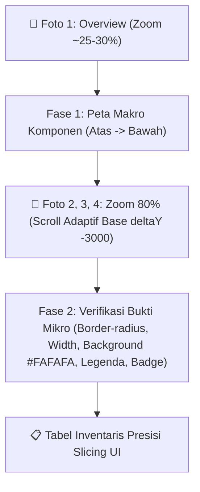

# 📖 Figma Chrome DevTools MCP — Panduan Deterministik Inspeksi Node

> Panduan ini memberikan **resep eksak** agar setiap session agent menghasilkan
> output yang **konsisten dan identik** saat menginspeksi node Figma via Chrome DevTools MCP.

## 🧠 PENGETAHUAN DASAR WAJIB TAHU

## 🚫 BATASAN RUNTIME WAJIB: HANYA CHROME DEVTOOLS

Seluruh inspeksi Figma pada panduan ini **WAJIB** dijalankan melalui sesi
**Google Chrome nyata yang dikendalikan oleh Chrome DevTools MCP**.

- **WAJIB:** gunakan Chrome nyata melalui Chrome DevTools MCP.
- **DILARANG:** gunakan browser internal Codex, AI IDE, ADE, atau `tab.cua`.
- Screenshot, zoom, scroll, dan `evaluate_script` harus berada di tab Chrome yang sama.
- Sebelum inspeksi, verifikasi `userAgent`, URL Figma, dan keberadaan canvas.
- Jika Chrome DevTools MCP tidak tersedia, agent harus berhenti dan melaporkan,
  bukan melakukan fallback.

### Verifikasi Runtime Sebelum Inspeksi

```javascript
return {
  userAgent: navigator.userAgent,
  isChrome: /Chrome\//.test(navigator.userAgent) && !/Edg\//.test(navigator.userAgent),
  url: location.href,
  hasCanvas: !!document.querySelector('canvas')
};
```

Lanjut hanya jika `isChrome: true`, URL adalah tab Figma yang benar, dan
`hasCanvas: true`.

### Cara Kerja Zoom di WebGL Kanvas Figma

Figma menggunakan WebGL canvas. Zoom dikontrol via `WheelEvent` pada elemen `<canvas>`:

| `ctrlKey` | `deltaY` | Efek |
|-----------|----------|------|
| `true` | **POSITIF (+)** | ✅ **ZOOM IN** (zoom naik) |
| `true` | **NEGATIF (-)** | ❌ **ZOOM OUT** (zoom turun) |
| `false` | **POSITIF (+)** | ⬆️ **Scroll UP** (naik ke atas — lihat konten atas) |
| `false` | **NEGATIF (-)** | ⬇️ **Scroll DOWN** (turun ke bawah — lihat konten bawah) |

> ⚠️ **PENTING:** Arah scroll di Figma WebGL canvas **TERBALIK** dari intuisi mouse biasa.
> `deltaY negatif` = turun ke bawah, `deltaY positif` = naik ke atas.

### Laju Zoom (Hasil Empiris)

```
deltaY: 180 (loop tanpa cek) → zoom 25% menjadi 660%
Laju ≈ 3.528% per unit deltaY

Untuk naik ~35% (dari 25% ke ~63%):
  35 ÷ 3.528 ≈ 10 unit deltaY

✅ Gunakan deltaY: 10 per step (aman, tidak overshoot)
```

### Target Dispatch Event

- **WAJIB** dispatch ke elemen `canvas` (WebGL Figma)
- Jika `document.querySelector('canvas')` mengembalikan `null` → **tunggu 2 detik dan retry**, JANGAN fallback ke `document.body`

---

## 📋 RESEP LENGKAP: STEP-BY-STEP DETERMINISTIK

### STEP 1 — Buka Node Figma Utama & Node Komponen Opsional

```javascript
// 1. Navigasi ke permalink Node Utama KESELURUHAN (Main Screen Frame).
// URL format: https://www.figma.com/design/[fileId]/[name]?node-id=[nodeId]
// ⏳ WAJIB tunggu 10 detik setelah navigate agar WebGL canvas selesai dimuat sempurna.
// 2. Apabila User memberikan link Node Komponen Spesifik (Opsional), selesaikan inspeksi Node Utama terlebih dahulu hingga paling bawah, lalu navigasikan ke masing-masing Node Komponen Spesifik untuk diperiksa secara detail.
```

### STEP 2 — Capture Screenshot 1 (Overview / Peta Makro Komponen)

Ambil **Screenshot 1 (Overview Node)** sebelum melakukan zoom-in (pada zoom ~25-30%). 

#### 🎯 Tugas Agent di Screenshot 1 (Overview):
Agent menggunakan Screenshot 1 ini untuk **Memetakan Komponen secara Garis Besar (Macro Mapping)** dari posisi paling atas hingga paling bawah:
- Urutan komponen makro: Title H3/H4 $\rightarrow$ Tabset Switcher $\rightarrow$ Filter Box $\rightarrow$ 3 Donut Cards $\rightarrow$ Bar Chart 1 $\rightarrow$ Bar Chart 2 $\rightarrow$ Bottommost Footer (jika berada di dalam frame node).

### STEP 3 — Baca Zoom Level Saat Ini

```javascript
// Fungsi baku pembaca zoom Figma
async function getFigmaZoom() {
  const el = Array.from(document.querySelectorAll('*')).find(
    e => e.children.length === 0 && /^\d+%$/.test(e.textContent.trim())
  );
  return el ? parseInt(el.textContent.trim()) : 0;
}
```

### STEP 4 — Zoom-In Adaptif ke ~80% (Super Tajam & Dekat)

```javascript
async function zoomInTo80() {
  const canvas = document.querySelector('canvas');
  if (!canvas) return 'ERROR: canvas not found, retry after 2s';

  // Focal point: agak ke atas dari tengah layar (mendekati garis atas frame node)
  const cx = window.innerWidth / 2;
  const cy = window.innerHeight * 0.3;

  const getZoom = () => {
    const el = Array.from(document.querySelectorAll('*')).find(
      e => e.children.length === 0 && /^\d+%$/.test(e.textContent.trim())
    );
    return el ? parseInt(el.textContent.trim()) : 0;
  };

  let attempts = 0;
  while (attempts < 60) {
    const current = getZoom();
    if (current >= 80) break; // ✅ Reached ~80% zoom for ultra-clear inspection

    // Kirim 1 event kecil POSITIF → tunggu → cek lagi
    canvas.dispatchEvent(new WheelEvent('wheel', {
      clientX: cx,
      clientY: cy,
      deltaY: 10,        // ✅ POSITIF = ZOOM IN, kecil agar tidak overshoot
      ctrlKey: true,
      bubbles: true,
      cancelable: true
    }));

    await new Promise(r => setTimeout(r, 500)); // Tunggu indikator zoom diperbarui
    attempts++;
  }

  return getZoom(); // Return zoom akhir (~80%)
}
```

**Aturan kritis STEP 4:**
- `deltaY` **WAJIB POSITIF** → negatif = zoom out
- Dispatch ke `canvas`, **BUKAN** `document.body`
  - Tunggu **500ms** tiap event zoom agar Figma sempat memperbarui indikator zoom
- Cek **SEBELUM** mengirim event berikutnya
- **JANGAN** gunakan keyboard shortcut (`Ctrl+Shift+H`, `Ctrl+Equal`, dll)

### STEP 5 — Ambil Screenshot Segmen Atas & Evaluasi Bottom Border

1. Ambil screenshot awal (overview node).
2. Setelah zoom-in ≥ 60% mendekati border atas node, ambil screenshot **Segmen Atas**.
3. Evaluasi apakah garis border bagian **PALING BAWAH (bottommost border)** dari node sudah terfoto secara utuh atau belum.

### STEP 6 — Auto-Scroll Adaptif untuk Bottom Border (Base 3000 + Increment 500)

- **Apabila bottom border SUDAH terlihat utuh pada Segmen Atas:** Lanjut langsung ke STEP 8 (Inspeksi Detail UI).
- **Apabila bottom border BELUM terlihat utuh (node panjang):**
  Agent **DILARANG MENANYAKAN PILIHAN KEPADA USER**. Agent **WAJIB LANGSUNG AUTO-SCROLL** canvas ke bawah dimulai dari base `deltaY = 3000` (`'down'` $\rightarrow$ `-3000`). Jika hasil screenshot menunjukkan tampilan foto masih sama/overlapping sebelum bottom border terfoto, naikkan magnitude `deltaY` sebesar `+500` (`-3500`, `-4000`, dst) pada scroll berikutnya, dan **LANGSUNG BERHENTI** begitu bottom border terfoto utuh.

### STEP 7 — Eksekusi Canvas Auto-Scroll Down Adaptif (Base 3000)

- Agent langsung menjalankan script scroll canvas ke bawah dengan **base deltaY = 3000** (atau nilai yang dinaikkan +500 jika terjadi overlap).
- Ambil screenshot setelah scroll untuk verifikasi bottom border node, dan langsung **BERHENTI** jika bottom border terfoto utuh.

```javascript
// Script Canvas Scroll Figma Adaptif (Base deltaY = -3000 untuk DOWN, +3000 untuk UP)
(targetDeltaY = -3000) => (async () => {
  const canvas = document.querySelector('canvas');
  if (!canvas) return 'ERROR: canvas not found';

  const cx = window.innerWidth * 0.5;
  const cy = window.innerHeight * 0.5;
  const steps = 10;
  const stepDelta = targetDeltaY / steps;

  for (let i = 0; i < steps; i++) {
    canvas.dispatchEvent(new WheelEvent('wheel', {
      clientX: cx,
      clientY: cy,
      deltaY: stepDelta,
      ctrlKey: false,
      bubbles: true,
      cancelable: true
    }));
    await new Promise(r => setTimeout(r, 15));
  }
  return `Scrolled canvas adaptif (total deltaY: ${targetDeltaY})`;
})()
```

// 💡 Catatan Standar Scroll Adaptif:
// - Base Scroll TURUN (DOWN) : targetDeltaY = -3000
// - Base Scroll NAIK  (UP)   : targetDeltaY = +3000
// - Jika tampilan foto masih sama/overlapping sebelum bottom border terfoto, naikkan magnitude deltaY +500 (-3500, -4000, dst)
```

### STEP 8 — Pemindaian Sekuensial Presisi 2-Fase (Peta Makro Foto 1 + Bukti Mikro Zoom 80%)

Agent **WAJIB** menjalankan **Analisis Sekuensial 2-Fase** untuk memastikan seluruh komponen terpetakan secara makro dan diverifikasi secara mikro tanpa ada yang terlewat:

#### 🔄 Alur Analisis 2-Fase Agent:



1. **FASE 1 — Peta Makro Komponen (Dari Foto 1 Overview / Zoom ~25-30%)**:
   - Agent menyusun Peta Urutan Komponen dari paling atas hingga paling bawah:
    `H3/H4 Title` $\rightarrow$ `Tabset Switcher` $\rightarrow$ `Filter Box` $\rightarrow$ `3 Donut Cards` $\rightarrow$ `Bar Chart 1` $\rightarrow$ `Bar Chart 2` $\rightarrow$ `Bottommost Footer (jika berada di dalam frame node)`.

2. **FASE 2 — Verifikasi Bukti Mikro (Dari Foto 2, 3, 4 pada Zoom 80%)**:
   - Agent mencocokkan setiap item di Peta Makro dengan bukti visual super-tajam pada zoom 80%:
     - **Segmen Atas (Foto 2 / Zoom 80%)**: Memverifikasi background filter abu-abu `#FAFAFA`, border `#E0E0E0`, border-radius, alignment lebar button `"Filter"` sejajar dengan dropdown DBMS, placeholder eksak.
     - **Segmen Tengah (Foto 3 / Zoom 80%)**: Memverifikasi konfirmasi 3 Donut cards sejajar (`flex gap 20px`), border-radius card `.custom-well`, legenda chart, badge total (`Total: 60 Aplikasi`, `199 Service`, `79 Database`).
    - **Segmen Bawah (Foto 4 / Zoom 80%)**: Memverifikasi Bar Chart 1 & 2, legenda, bar colors, dan copyright footer text jika footer berada di dalam frame node.

#### 📋 Output Tabel Inventaris Presisi Slicing UI (Peta Makro + Bukti Mikro):

> **Contoh ilustratif di bawah diambil dari pilot tim EA.** Sesuaikan nama komponen, class, dan gaya dengan UI library (`ui_library` di `team.json`), style global (`frontend.styles_file`), dan fitur pembanding tim Anda. Struktur kolom dan prosedurnya bersifat baku.

| Posisi (Atas $\rightarrow$ Bawah) | Elemen / Komponen Visual | Teks / Label Eksak | CSS & Detail Spesifikasi (Zoom 80%) | Pemetaan Komponen Target |
|---|---|---|---|---|
| **1. Topmost Header** | Title Halaman | `"Monitoring Aplikasi"` | Tag `<h4 class="content-header-title">` | Style Global (`frontend.styles_file`) |
| **2. Navigation Switcher** | Tabset Button | `"Grafik"`, `"Tabel"` | Wrapper `.button-container` + `.custom-button` | Style baku fitur pembanding tim |
| **3. Filter Section** | Card Filter Box | `"Pemilik Aplikasi"`, `"Tahun Rilis"`, dll | Card `#FAFAFA`, border `#E0E0E0`, `.custom-filter-well` | Style Global (`frontend.styles_file`) |
| **4. Dropdown Controls** | Select Items (x6) | Placeholder: `"Semua Unit"`, `"Semua Tahun"`, dll | Component `<uii-dropdown-v2>` (`[allowClear]="false"`) | UI Library Tim (`ui_library.docs_folder`) |
| **5. Action Button** | Button Filter | `"Filter"` | Primary Button `#002F87` (Sejajar Dropdown DBMS) | UI Library / Standard Button |
| **6. Chart Row (Donut)** | 3 Donut Cards | `"Kategori Aplikasi"`, `"Framework"`, `"DBMS"` | Flex Gap `20px`, wrapper `.custom-well`, height `210px` | Chart library dari `package.json` + `styles.scss` |
| **7. Total Summary Banner** | Card Footer Banner | `"Total: 60 Aplikasi"`, `"199 Service"`, `"79 Database"` | Class `.card-footer-banner` (`margin-top: 20px`) | Style baku fitur pembanding tim |
| **8. Chart Section (Bar 1)**| Bar Chart Framework | `"Jumlah Service untuk Setiap Framework"` | Wrapper `<div class="custom-well">`, height `360px` | Chart library dari `package.json` |
| **9. Chart Section (Bar 2)**| Bar Chart Tahun Rilis| `"Jumlah Aplikasi yang Rilis Setiap Tahunnya"` | Wrapper `<div class="custom-well">`, height `360px` | Chart library dari `package.json` |
| **10. Data Table (Opsional)**| Table Grid & Auth | Columns, Row Items, Action Buttons | Component `<uii-table>` (HTML col `type: 'html'`, `auth.canRead`) | UI Library Tim (`ui_library.docs_folder`) |
| **11. Bottommost Footer (jika berada di dalam frame node)** | Copyright Line | `"Copyright: Badan Sistem Informasi Universitas Islam Indonesia"` | Text Small `#666666` | Standard Footer Text |

#### 🔍 Checklist Micro-Detail (Zoom 80% Verification):
- **Badge / Status dot**: Pastikan bulatan warna menggunakan CSS class `badge-dot` (BUKAN emoji unicode `🔵`).
- **Tombol Aksi**: Catat jika ada ikon dropdown (`▾`) di samping tombol.
- **Filter Dropdown**: Pastikan `selectOptions` diinisialisasi `null` dan menggunakan `[allowClear]="false"`.
- **Card Wrapper Chart**: Pastikan atribut `[chart]` dibungkus div terpisah di dalam `<div class="custom-well">` untuk mencegah clipping border.
- **Tabel UI Library**: Setiap objek baris data wajib mencantumkan `auth: { canRead: true }` dan kolom ber-HTML diset `type: 'html'` *(konvensi tabel UI library pilot tim EA — cek padanan API di `ui_library.docs_folder` tim Anda)*.

### STEP 9 — Konfirmasi Komponen & Hirarki Pencarian (UI LIBRARY > DEPENDENCY > FILE/FOLDER)

Setelah inspeksi selesai, **WAJIB konfirmasi** ke user dengan alur pencarian 3 tingkat:
1. **PERPUSTAKAAN UI LIBRARY TIM (`ui_library.docs_folder` dari `team.json`)**:
   - Pemetaan ke tag UI library tim (contoh dari pilot tim EA: `uii-table`, `uii-modal`, `uii-infobox`, `uii-dropdown-v2`, `uii-tabset-v2`, dll).
2. **Library DEPENDENCY (`package.json`)**:
   - Cek apakah elemen yang tidak ada di UI library sudah tersedia di dependensi project (misal: chart library, date library, select library yang terpasang).
3. **EXISTING FILE / FOLDER (`frontend.module_root` dari `team.json`)**:
   - Cek apakah sudah ada komponen / contoh penggunaan serupa di codebase (contoh dari pilot tim EA: komponen chart yang mengimpor `Chart` dari library chart yang terpasang).
4. **⚠️ HIGHLIGHT EKSPLISIT CUSTOM COMPONENT**:
   - Buat tabel / section terpisah yang secara jelas menghighlight elemen mana saja yang **HARUS DIBUAT CUSTOM** (apabila tidak ditemukan di UI Library, Dependency, maupun Existing Code), beserta **penjelasan teknis mengapa harus custom**.
- Rancangan HTML (`.component.html`) & skema data dummy (`.component.ts`) secara eksplisit & lengkap di chat.
- **TUNGGU kata kunci `"kerja"`** sebelum menulis file fisik.


## ⚠️ PANDUAN PENANGANAN MASALAH (TROUBLESHOOTING)

| Gejala | Penyebab | Solusi |
|--------|----------|--------|
| Zoom turun saat zoom-in | `deltaY` negatif terkirim | Pastikan `deltaY` selalu POSITIF untuk zoom-in |
| Event tidak berdampak | Dispatch ke `document.body` | Dispatch ke `canvas` element |
| Zoom anjlok ke 2-5% | `Ctrl+Shift+H` ditekan | Jangan gunakan keyboard shortcut, navigate ulang ke URL node |
| Zoom melonjak ke 300%+ | Loop terlalu cepat tanpa `await` | Tambahkan `await 500ms` & cek IF sebelum dispatch berikutnya |
| `canvas` null | Halaman belum selesai load | Tunggu 2 detik dan retry querySelector |
| Scroll UP malah turun | `deltaY` negatif dipakai untuk UP | Di Figma: **POSITIF = naik ke atas, NEGATIF = turun ke bawah** |
| Zoom ke node yang salah | Focal point `cy` terlalu di tengah | Gunakan `cy = window.innerHeight * 0.3` (agak atas) |

---

## ✅ TEMPLATE FUNGSI LENGKAP SIAP PAKAI (COPY-PASTE EVALUATE_SCRIPT)

### 1. Template Zoom-In ke 80% (IIFE)
```javascript
(async () => {
  const canvas = document.querySelector('canvas');
  if (!canvas) return 'ERROR: canvas not found';

  const cx = window.innerWidth / 2;
  const cy = window.innerHeight * 0.3;

  const getZoom = () => {
    const el = Array.from(document.querySelectorAll('*')).find(
      e => e.children.length === 0 && /^\d+%$/.test(e.textContent.trim())
    );
    return el ? parseInt(el.textContent.trim()) : 0;
  };

  let attempts = 0;
  while (attempts < 60) {
    if (getZoom() >= 80) break;
    canvas.dispatchEvent(new WheelEvent('wheel', {
      clientX: cx, clientY: cy,
      deltaY: 10, ctrlKey: true,
      bubbles: true, cancelable: true
    }));
    await new Promise(r => setTimeout(r, 500));
    attempts++;
  }
  return { finalZoom: getZoom(), status: 'Ready for Segmen Atas Screenshot' };
})()
```

### 2. Template Canvas Scroll Figma Adaptif (Base deltaY = 3000, Dynamic Increment +500)
```javascript
// Copy-paste ke evaluate_script Chrome DevTools MCP
// Untuk Scroll TURUN (DOWN): panggil dengan (targetDeltaY) -> e.g. -3000, -3500, -4000
// Untuk Scroll NAIK  (UP)  : panggil dengan (targetDeltaY) -> e.g. +3000, +3500, +4000
(targetDeltaY = -3000) => (async () => {
  const canvas = document.querySelector('canvas');
  if (!canvas) return 'ERROR: canvas not found';

  const cx = window.innerWidth * 0.5;
  const cy = window.innerHeight * 0.5;
  const steps = 10;
  const stepDelta = targetDeltaY / steps; // -300 per step untuk base -3000

  for (let i = 0; i < steps; i++) {
    canvas.dispatchEvent(new WheelEvent('wheel', {
      clientX: cx,
      clientY: cy,
      deltaY: stepDelta,
      ctrlKey: false,
      bubbles: true,
      cancelable: true
    }));
    await new Promise(r => setTimeout(r, 15));
  }
  return `Scrolled canvas adaptif (total deltaY: ${targetDeltaY})`;
})()
```
